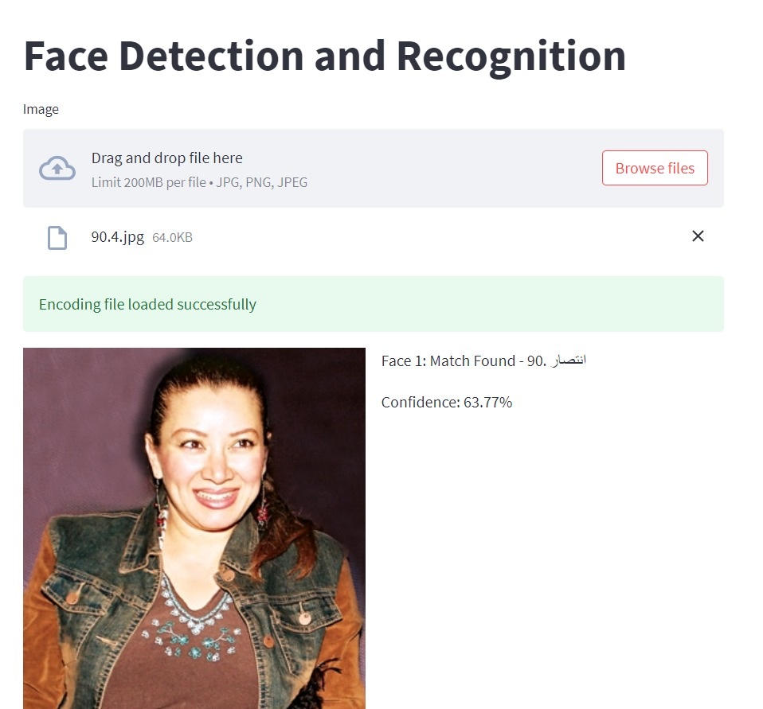

# Face-Recognition and Search App
Welcome to the Face Recognition and Search App, a Streamlit-based application for recognizing and searching faces across image datasets. Developed as part of my internship at the Ministry of Communications and Information Technology (MCIT), this project showcases a user-friendly platform for face recognition, leveraging machine learning and image processing techniques.

Features
Face Recognition: Detect and recognize faces from uploaded images, using state-of-the-art face recognition models.
Face Search: Easily search for specific faces across an image database.
Image Preprocessing: Handle and process images with low resolutions and varied characteristics for enhanced recognition accuracy.
Interactive UI: Built with Streamlit, offering a simple and responsive interface for uploading and processing images.

## Final Product

Here’s a snapshot of the Face Recognition and Search App:

*Figure: Interface of the Face Recognition and Search App built with Streamlit.*
